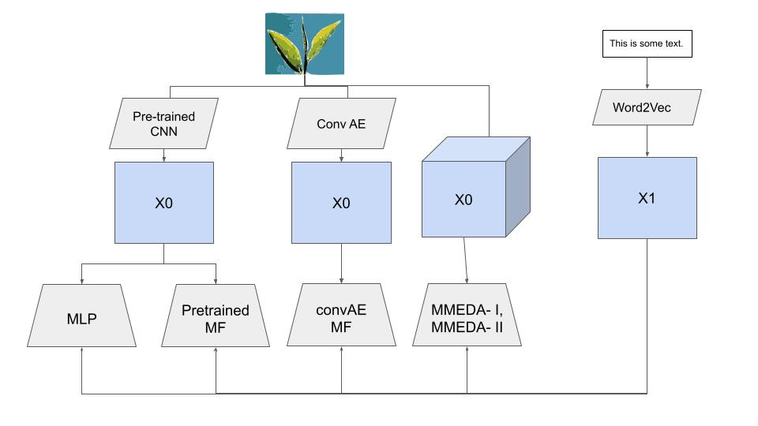

# CS5260-Neural-Networks-2
This code repo has the following folders:

- data_collection: Run the notebooks in the path to download the dataset associated with the project https://sites.google.com/eng.ucsd.edu/ucsdbookgraph/home and to extract 5000 books and their features.

- dataset: This folder has the relevant image covers of 5000 books and the associated features in the file books_with_genres.csv. Ensure to extract the files from their equivalent tar files using the commands:
```
tar -xvzf images.tar
tar -zvzf books_with_genres.tar
tar -xvzf goodreads_book_genres_initial.tar
```

- matrix\_factorization - This folder contains the models that use matrix factorization to learn representations - pre-trained CNN approach, convolution AE based approach, MMEDA - I and MMEDA - II

- downstream\_tasks - This folder contains metrics to evaluate learnt representations by performing downstream classification and regression tasks.

- benchmarks - This folder has the implementation for CMF, used as a benchmark for comparison.

Other files in this folder are:

- GoogleNet.ipynb, InceptionNet.ipynb, ResNet.ipynb, VGG\_pre\_trained\_v3.ipynb - used to generate pre-trained CNN representations for images, to be used in matrix factorization

- ImageAutoEncoder.ipynb - generates convolutional autoencoder representations for images

- Word2Vec-Average.ipynb, Word2Vec-Average-300.ipynb - generates word2vec representations for all words in a sentence and averages it out over each sentence - both 100 and 300 dimensional representations are generated here.

- mlp\_genres.ipynb, mlp\_rating.ipynb - MLP baseline for comparison - both classification and regression tasks

- sentencebert.ipynb - used to generate sentenceBert representations from text

- wv\_mlp\_`*`.ipynb - Uses one of the 4 pre-trained CNN representations with word2vec representations for classification and regression, using MLP.

#### Environment setup
Ensure Anaconda is set up and use the environment.yml in the code repo to set up an environment as follows:
```
conda env create -f environment.yml

conda activate cs5260


```

#### Overall Pipeline 

